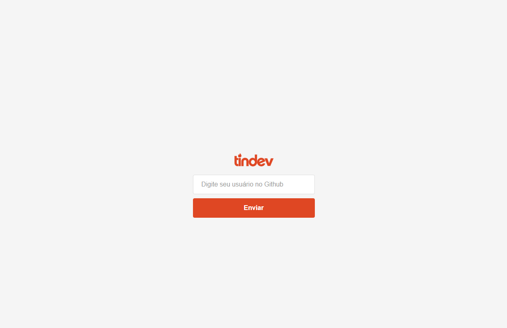
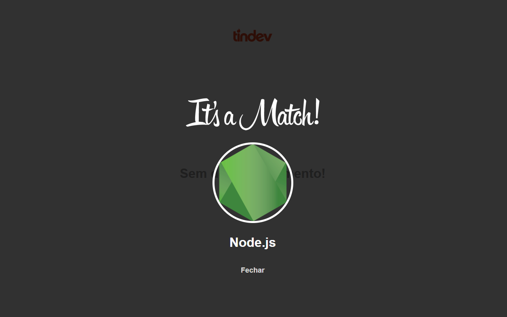
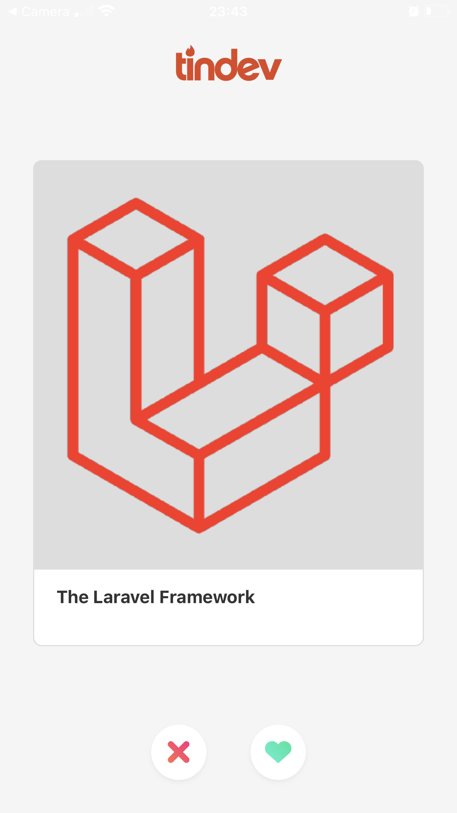
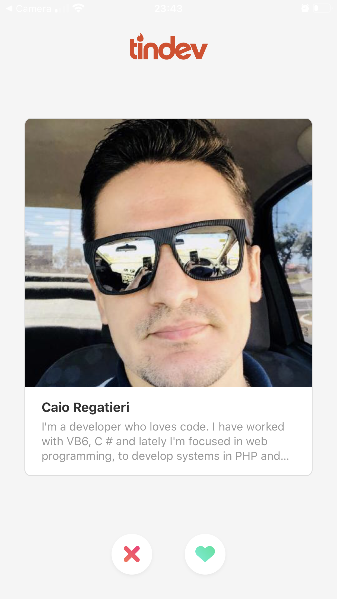

# tindev

This project was developed in my quaretine during the [Week Omnistak by RocketSeat](https://rocketseat.com.br/week/aulas/8.0).

### Tech

In this project we used:

* NodeJS - Backend
* React - Frontend
* React-Native (Expo) - Mobile
* MongoDB - Database
* Socket.io - Real-time